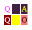

# skip invisible letters (JS)

You are in browser-like environment, where you have access to the window object, the document 
object, and also ```$``` - the jQuery library. The document contains a two-dimensional table. Each cell of 
the table has an upper-case letter in it and has its background color and text color set. Your task is 
simply to read the letters in row-major order (top to bottom, left to right), concatenate them into a 
single string and return it. However, you need to skip the letters that cannot be seen by the human 
eye. These are the ones whose colour is exactly the same as their background (that is, even 
marginal difference can be distinguished by a human eye).

The table is created using ```"table"```, ```"tbody"```, ```"tr"``` and ```"td"``` tags. Each ```"td"``` tag has a style 
attribute with its CSS ```"background-color"``` and ```"color"``` attributes set. There is the same number 
of cells in each row.

Write a function

```function solution();```
	
that, given a DOM tree representing an HTML document, returns a string containing all visible letters, read 
in row-major order.

For example, given a document which has the following table in its body:

```
<table>
	<tbody>
	<tr>
		<td style="color: #ff00ff; background-color: #FFFFFF">Q</td>
		<td style="background-color: #442244; color: #442244">Y</td>
		<td style="color: #FFFF00; background-color: #442244">A</td>
	</tr>
	<tr>
		<td style="color: #FFEEFE; background-color: #990000">Q</td>
		<td style="color: #FFFF00; background-color: #FF0">M</td>
		<td style="color: #000000; background-color: #FF7777">O</td>
	</tr>
	</tbody>
</table>
```

which, when displayed in a browser produces the following output:
```

```
    
your function should return "QAQO" since the letters "Y" and "M" are invisible.